<div align="center">

# 🐉 FlashLearn — Architecture & System Guide

#### *Learn faster. Speak better. Remember forever.*

A flashcard study platform with **AI term enrichment**, an **AI Speaking Coach**,
real-time **multiplayer revision**, a **Chrome extension**, and a dual
**Django + Rust** backend sharing one database.

<br/>


</div>

> [!TIP]
> **All diagrams below are [Mermaid](https://mermaid.js.org/) and render live on GitHub / VS Code / Cursor.**
> They are the closest thing to an animated walkthrough — follow the arrows top‑to‑bottom to "play" each flow.

---

## 📑 Table of Contents

| # | Section | What you'll learn |
|---|---------|-------------------|
| 1 | [The 30‑second tour](#-the-30-second-tour) | What FlashLearn is, at a glance |
| 2 | [Tech stack](#-tech-stack) | Every technology and why it's here |
| 3 | [System architecture](#-system-architecture-birds-eye-view) | How the pieces fit together |
| 4 | [Repository map](#-repository-map) | Where everything lives |
| 5 | [The DDD backend](#-the-ddd-backend-bounded-contexts) | Bounded contexts & layering |
| 6 | [Data model](#-data-model-er-diagram) | The database, visually |
| 7 | [Request lifecycle](#-request-lifecycle) | A request from click to DB |
| 8 | [🤖 The AI engine](#-the-ai-engine) | Providers, failover, rate‑gate |
| 9 | [✨ AI term enrichment](#-ai-flow-1--term-enrichment) | Bare word → dictionary entry |
| 10 | [🗣️ AI Speaking Coach](#️-ai-flow-2--the-speaking-coach) | Dialogue + pronunciation scoring |
| 11 | [🎮 Realtime multiplayer](#-realtime-the-quick-revise-game) | The WebSocket game |
| 12 | [🧠 Learning & memory](#-learning--spaced-revision) | The revision scoring model |
| 13 | [Frontend architecture](#-frontend-architecture) | React app structure |
| 14 | [Background jobs](#-background-jobs--cron) | Worker, scheduler, emails |
| 15 | [Chrome extension](#-chrome-extension) | Select‑to‑save anywhere |
| 16 | [Deployment](#-deployment) | Docker & images |

---

## 🚀 The 30‑second tour

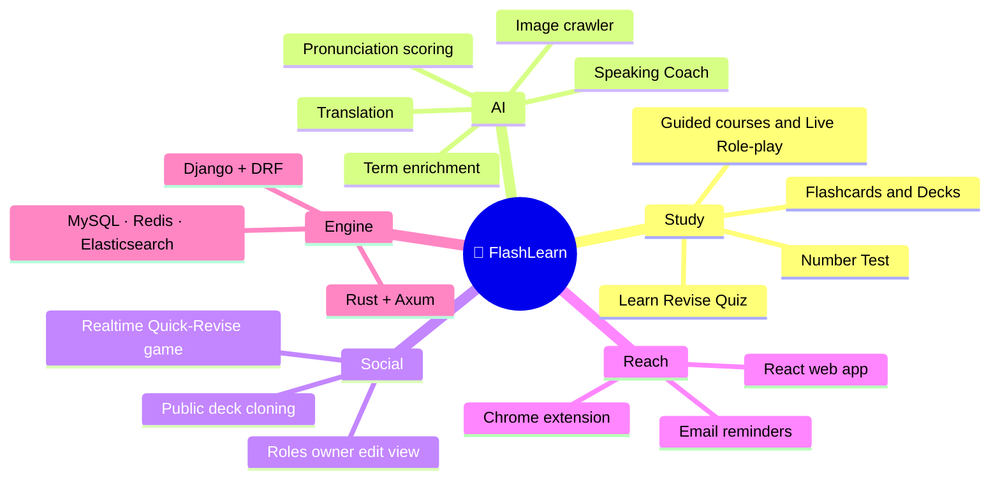

FlashLearn turns a plain word into a rich, Oxford‑style flashcard using AI, lets
you study it in multiple game modes, practice **speaking** it with an AI coach
that scores your pronunciation, and **race friends** to revise — all themeable,
mobile‑first, and installable as a browser extension.

---

## 🧰 Tech stack

<table>
<tr><th>Layer</th><th>Technology</th><th>Role in FlashLearn</th></tr>

<tr><td rowspan="6"><b>🐍 Django backend</b><br/><sub>primary API</sub></td>
<td>Python 3.11 · Django 4.2</td><td>Core web framework, ORM, migrations (owns the schema)</td></tr>
<tr><td>Django REST Framework 3.15</td><td>ViewSets, serializers, the REST API surface</td></tr>
<tr><td>Django Channels 4 + Daphne</td><td>ASGI server & WebSockets for the multiplayer game</td></tr>
<tr><td>SQLAlchemy 2 (read side)</td><td>Hand‑tuned read queries alongside the Django ORM</td></tr>
<tr><td>django‑rq + rq‑scheduler</td><td>Background jobs & cron (emails, cache cleanup, backups)</td></tr>
<tr><td>drf‑yasg</td><td>Swagger / ReDoc API docs (DEBUG only)</td></tr>

<tr><td rowspan="4"><b>🦀 Rust backend</b><br/><sub>opt‑in replacement</sub></td>
<td>Rust 2021 · Axum 0.7</td><td>High‑performance partial re‑implementation of the API</td></tr>
<tr><td>SQLx 0.8 · Tokio 1</td><td>Async MySQL access over the same schema</td></tr>
<tr><td>JWT · pbkdf2</td><td>Token validation & Django‑compatible password checks</td></tr>
<tr><td>DDD layering</td><td>domain / application / infrastructure / interfaces</td></tr>

<tr><td rowspan="6"><b>⚛️ React frontend</b></td>
<td>React 18</td><td>SPA UI</td></tr>
<tr><td>Material UI 7 + Emotion</td><td>Component library & styling</td></tr>
<tr><td>Redux Toolkit 2 + React‑Redux</td><td>Global state</td></tr>
<tr><td>TanStack Query 5</td><td>Server‑state caching & fetching</td></tr>
<tr><td>React Router 7</td><td>Routing</td></tr>
<tr><td>Sass + CSS custom properties</td><td>Runtime theming (light/dark + palettes)</td></tr>

<tr><td rowspan="4"><b>🗄️ Data & infra</b></td>
<td>MySQL 8</td><td>System of record (shared by both backends)</td></tr>
<tr><td>Redis 6</td><td>Cache, RQ queue, Channels layer, AI rate‑gate</td></tr>
<tr><td>Elasticsearch 8</td><td>Full‑text deck & term search</td></tr>
<tr><td>Cloudinary</td><td>Image storage / optimization</td></tr>

<tr><td rowspan="4"><b>🤖 AI & external</b></td>
<td>Google Gemini</td><td>Multimodal: term enrichment, dialogue, TTS, pronunciation</td></tr>
<tr><td>OpenRouter</td><td>Text/JSON fallback provider</td></tr>
<tr><td>Google OAuth</td><td>Social login</td></tr>
<tr><td>Playwright (Chromium)</td><td>Headless fallback for the Google image crawler</td></tr>

<tr><td><b>🧩 Extension</b></td>
<td>React + Chrome MV3</td><td>Select‑text‑to‑save on any web page</td></tr>

<tr><td><b>🚢 Delivery</b></td>
<td>Docker Compose · Podman · Nginx</td><td>Local, dev hot‑reload, and self‑service deployment</td></tr>
</table>

---

## 🗺️ System architecture (bird's‑eye view)

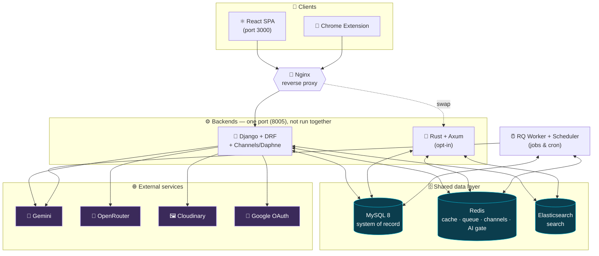

> [!NOTE]
> **Both backends speak the same database and the same port 8005.** They are
> *never* run simultaneously — the Rust backend is an opt‑in, in‑progress
> performance re‑implementation. **Django owns all migrations**; Rust only
> reads/writes the schema Django defines.

---

## 📁 Repository map

```text
flashlearn/
├── core/                      ⚙️  Django project: settings, ASGI/WSGI, URL root, auth
├── backend/                   🧠  All domain logic (see "DDD backend" below)
│   ├── deck/  term/  user/    📦  Bounded contexts (DDD: domain/application/infrastructure)
│   ├── learning/  role/  folder/  speaking/
│   ├── course/  reminders/    📚  Guided courses & home "pick up where you left off"
│   ├── shared/                🔌  Cross-context: composition root, AI, cache, ports
│   │   ├── composition.py     🧩  Wires concrete infra into services (DI root)
│   │   └── infrastructure/ai/ 🤖  Gemini · OpenRouter · ElevenLabs · Azure Speech/TTS, failover, rate-gate
│   ├── models/                🗃️  Django ORM models (schema owner)
│   ├── views/                 🚪  DRF ViewSets per resource
│   ├── serializers/           🔄  DRF serializers
│   ├── consumers.py           🎮  WebSocket consumer for the Quick-Revise game
│   ├── tasks.py + cron/       ⏰  RQ tasks & schedules
│   └── documents/             🔎  Elasticsearch document mappings
├── base/                      🧱  Shared abstract models (UUID, timestamps, User base)
├── rust_backend/src/          🦀  domain / application / infrastructure / interfaces
├── frontend/src/              ⚛️  React SPA (see "Frontend architecture")
├── extension/                 🧩  Chrome extension (React + MV3)
├── media/  dump/              📂  Local media & DB dumps
├── docker-compose*.yml        🚢  Prod, dev hot-reload, self-service variants
└── graphify-out/              🕸️  Generated knowledge graph of the codebase
```

---

## 🧩 The DDD backend (bounded contexts)

The `backend/` package is organized as **Domain‑Driven Design bounded contexts**.
Each context (`deck`, `term`, `user`, `learning`, `role`, `folder`, `speaking`,
`course`, `reminders`) has the same internal layering, and they talk to each
other only through small **Context APIs** (or another context's application
service, injected at the composition root) — never by reaching into each other's
internals. Simple contexts (e.g. `reminders`) may omit the `domain/` layer; when
present, `domain/` stays **pure Python** with no Django/ORM/I/O imports.

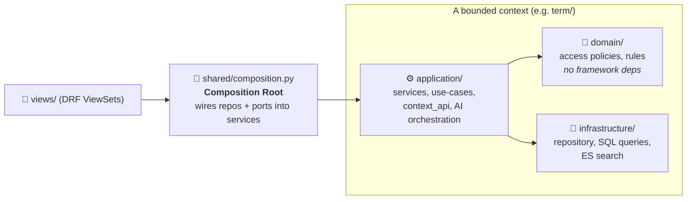

**How a context is wired** — the composition root is the single place where
abstract *ports* meet concrete *adapters*:

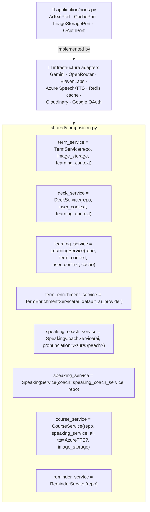

> [!IMPORTANT]
> **Why this matters:** services depend on **Protocols (ports)**, not concrete
> classes. That's why the AI provider can be swapped (Gemini ↔ OpenRouter), the
> cache can fall back from Redis to in‑process, and tests can inject fakes —
> all without touching business logic.

**The 10 most connected "god nodes"** (from the codebase knowledge graph) tell
you where the gravity is:

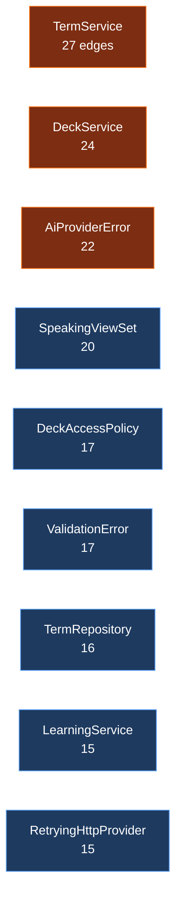

---

## 🗂️ Data model (ER diagram)

All entities use **UUID primary keys** and timestamp mixins (`base/models`).

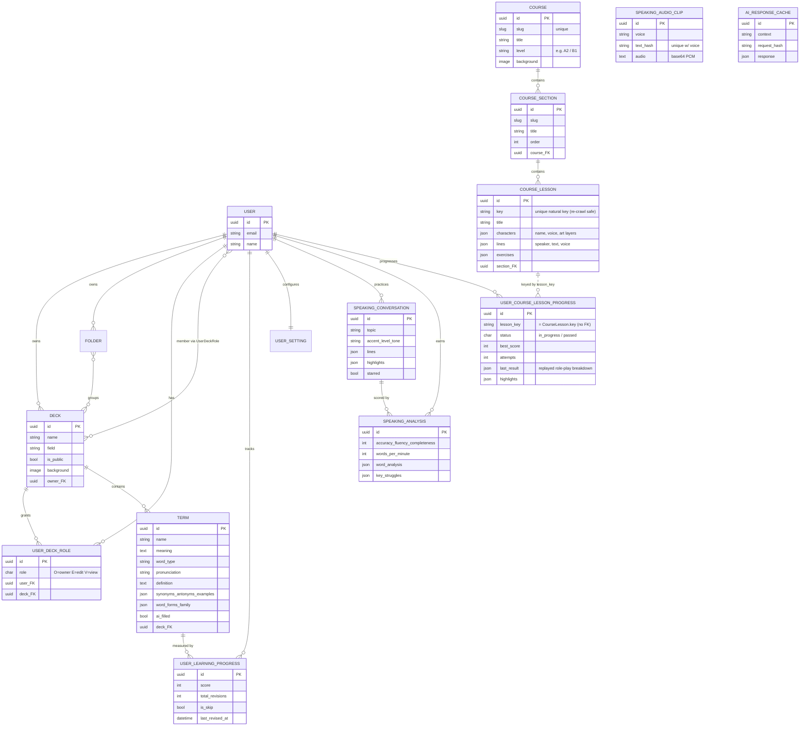

**Course progress is decoupled from content:** `UserCourseLessonProgress` is keyed
on the lesson's stable string `lesson_key` (not a row FK), so a clean re‑crawl can
delete and recreate every lesson row without ever cascading away a learner's
role‑play progress.

**Sharing model:** access to a deck is governed by `UserDeckRole` with three
roles, enforced by the framework‑independent `DeckAccessPolicy` in the domain
layer:

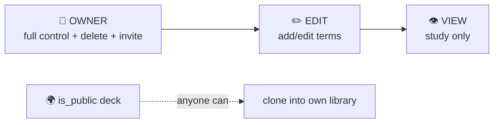

---

## 🔄 Request lifecycle

A typical authenticated REST call from the SPA to the database:

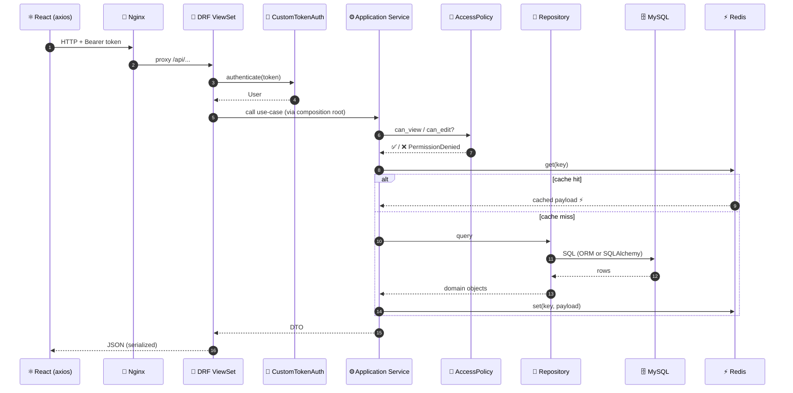

**Auth note:** FlashLearn uses **custom token auth** (not the standard
SimpleJWT flow). `POST /api/users/login` returns a token; `SECRET_KEY` signs it
and is shared with the Rust backend so tokens are interchangeable. Google OAuth
is available at `POST /api/users/google_login`.

### Key API routes

| Route | Purpose |
|-------|---------|
| `/api/decks/` · `/api/terms/` · `/api/folders/` | CRUD via DRF router |
| `/api/users/login` · `/api/users/google_login` | Custom token & OAuth login |
| `/api/learnings/` | Learning progress & revision |
| `/api/roles/` | Deck membership / invites |
| `/api/speaking/` | Speaking Coach (dialogue, TTS, analysis, history) |
| `/api/courses/` | Guided courses: catalog, content, lesson audio, Live Role‑play scoring |
| `/api/reminders/` | Home‑page "pick up where you left off" prompts |
| `/api/images/` | Image crawler (Google/Bing/Openverse/Wikimedia) |
| `/api/translate/` | Translation |
| `/ws/quick-revise/` | WebSocket multiplayer game |
| `/api/swagger/` | API docs (DEBUG only) |

---

## 🤖 The AI engine

AI is treated as **infrastructure behind a port**. Application services
(`TermEnrichmentService`, `SpeakingCoachService`) depend only on `AiTextPort` —
the concrete provider is chosen at the composition root and protected by two
resilience layers: **failover** and a **cross‑process rate gate**.

### Provider selection & failover

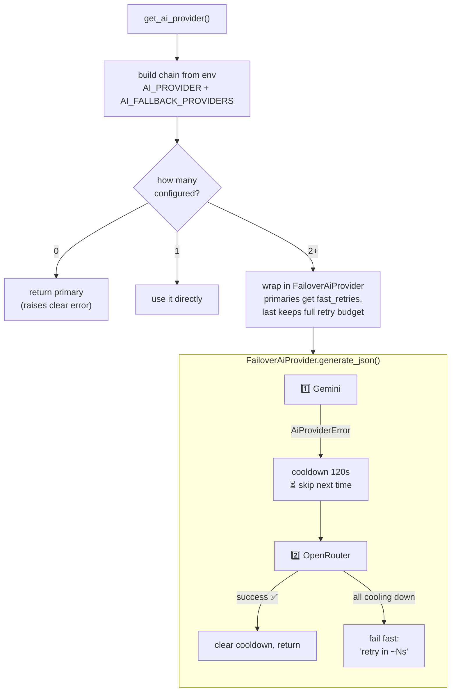

> [!TIP]
> A provider that fails gets a **120s cooldown** so the next request skips it
> instead of paying its retry/backoff again — crucial when the primary is
> rate‑limited for a sustained window. If *everything* is cooling down, the call
> **fails fast** with a "retry in ~Ns" message instead of hanging.

### The global rate gate (Redis‑backed)

Free‑tier AI quotas are strict, and multiple Django/worker processes share them.
A **Redis Lua‑scripted gate** enforces *one‑at‑a‑time + requests‑per‑minute*
**across all processes**, degrading gracefully to an in‑process gate if Redis is
unavailable.

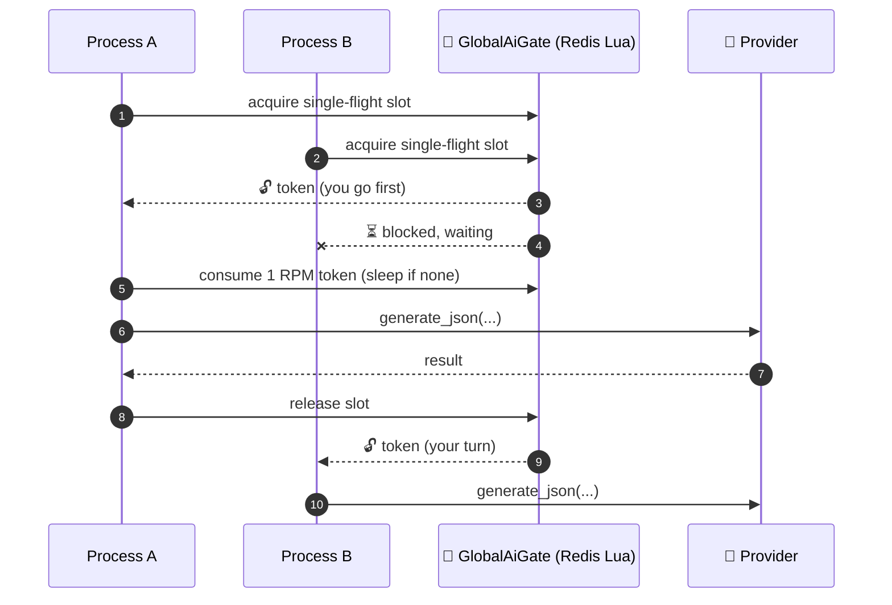

### Provider capability matrix

| Provider | Text / JSON | Multimodal (audio in) | TTS (audio out) | Role |
|----------|:-----------:|:---------------------:|:---------------:|------|
| **Gemini** | ✅ | ✅ | ✅ | Primary text/JSON + multimodal listener; legacy TTS voices |
| **OpenRouter** | ✅ | ❌ | ❌ | Text/JSON fallback (free tier by default) |
| **ElevenLabs** | ❌ | ❌ | ✅ | Active Speaking‑Coach tutor TTS (US/UK/AU voices) |
| **Azure Speech** | ❌ | ✅ | ❌ | *Measured* pronunciation assessment (accuracy/fluency/phonemes) |
| **Azure TTS** | ❌ | ❌ | ✅ | Per‑character course dialogue voices |

> [!NOTE]
> Only **Gemini** and **OpenRouter** sit in the env‑driven failover chain
> (`AI_PROVIDER` / `AI_FALLBACK_PROVIDERS`). **ElevenLabs**, **Azure Speech**, and
> **Azure TTS** are single‑purpose adapters wired directly at the composition
> root and used only when their credentials are present — each degrades
> gracefully (e.g. Azure pronunciation falls back to the Gemini multimodal
> listener; ElevenLabs falls back to legacy Gemini voices).

AI responses are also persisted in `AiResponseCache`, keyed by a stable
`sha256(context + request inputs)` so identical generations are never paid for
twice. Synthesized speech is cached forever in `SpeakingAudioClip`
(keyed by `voice + text_hash`), shared by both the Speaking Coach and course
dialogue audio.

---

## ✨ AI flow 1 — Term enrichment

Turn a bare word (`"oil"`) into a full Oxford‑style flashcard. The
`TermEnrichmentService` owns the prompt, rules, and a strict JSON schema so the
frontend stays a pure UI layer.

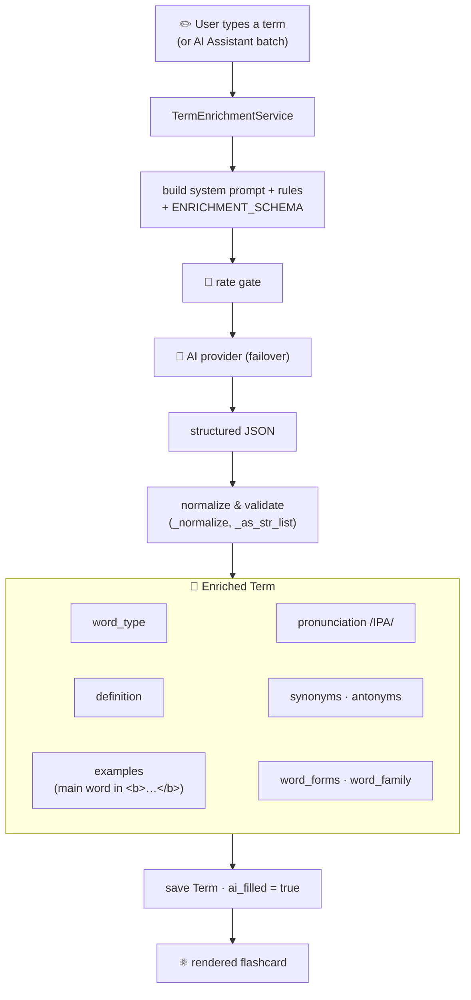

**Smart rules baked into the prompt:** single words get full grammatical data;
phrases/idioms/acronyms focus on definition + examples (e.g. `GOAT → "Greatest
Of All Time"`); every example wraps the term in `<b>…</b>` for highlighting; it
never translates the native‑language meaning. A backfill cron enriches any
terms still missing data, skipping ones where `ai_filled` is already set.

---

## 🗣️ AI flow 2 — The Speaking Coach

The marquee feature: generate a natural dialogue, let the user **record
themselves**, and get **per‑word pronunciation scoring** with IPA, mouth tips,
and rhythm — powered by Gemini's multimodal + TTS capabilities.

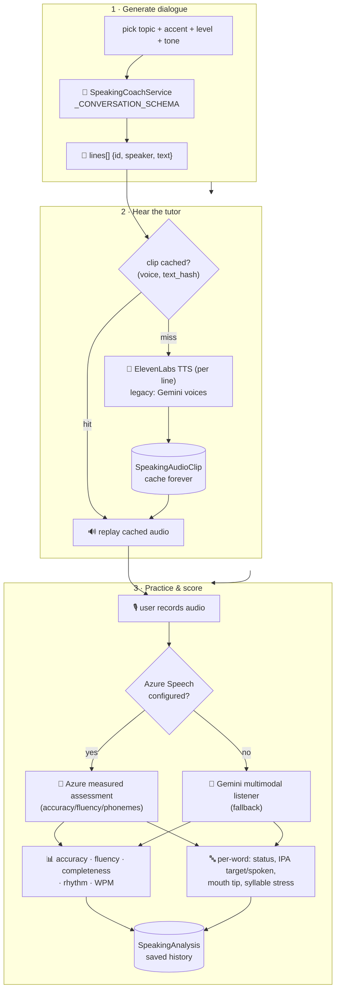

> [!NOTE]
> **Why audio is cached per‑line:** TTS is a billed call and a sentence renders
> identically every time, so the coach synthesizes **one clip per line** and
> stores it in `SpeakingAudioClip` (shared across all users, keyed by
> `voice + text_hash`) — replayed forever, generated once. The same cache backs
> the guided‑course dialogue audio (see below).

Conversations are saved to history (star, note words/phrases, reopen by URL),
and the coach can surface **your own deck terms** that appear in a dialogue.

### Guided courses & Live Role‑play

The `course` context reuses the same engine to teach structured, level‑based
curricula (imported from freeCodeCamp via `crawl_english_courses`). Each lesson
is a dialogue scene: characters get a fixed **Azure TTS** voice matching their
gender (assigned once by `generate_course_audio`), and the learner passes a
lesson by recording a **Live Role‑play** that `CourseService` scores
sentence‑by‑sentence through the Speaking Coach's pronunciation analysis. A
lesson flips to *passed* only when the averaged score clears
`COURSE_PASS_THRESHOLD` (a pure rule in `course/domain/progress.py`); the latest
breakdown is persisted so the lesson page can replay it on revisit.

---

## 🎮 Realtime: the Quick‑Revise game

A multiplayer race over **Django Channels + Daphne**, with Redis as the channel
layer. Players answer revision questions against a per‑term **time limit** that
adapts to difficulty.

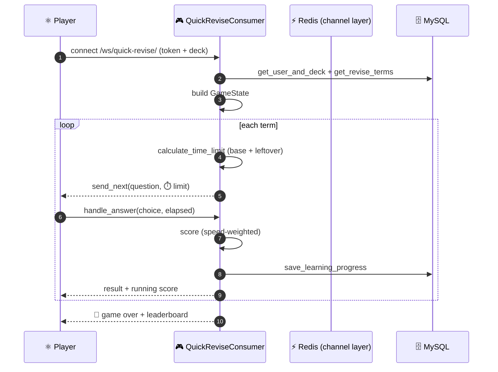

The time limit is computed from a base time plus carried‑over leftover time, so
fast players bank time and harder terms get more of it.

---

## 🧠 Learning & spaced revision

Every `(user, term)` pair has a `UserLearningProgress` row driving what to study
next. Services adjust `score` on correct/incorrect answers, track
`total_revisions`, and let users `skip` mastered terms.

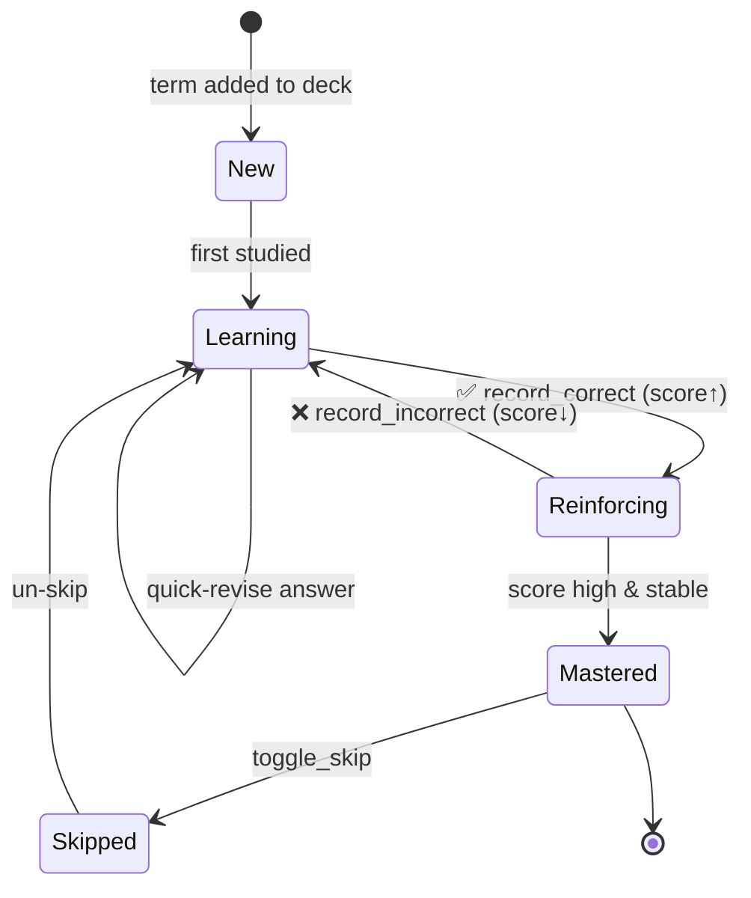

Progress reads are **cache‑first** (`_LearningProgressCache` over Redis) with an
hourly cron evicting stale entries, and the `LearningService` composes data from
the `term` and `user` contexts via their Context APIs — never direct imports.

---

## ⚛️ Frontend architecture

A Material‑UI SPA with a clean separation between **pages**, a typed **API
service layer**, global **Redux** state, and **server state** via TanStack Query.

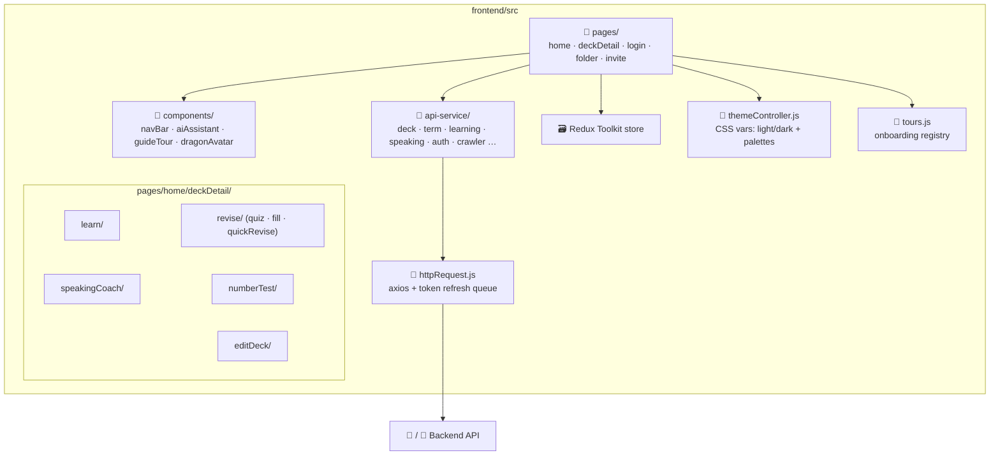

**Three frontend conventions enforced by project rules:**

| 🎨 Theming | 📱 Responsive | 🐉 Onboarding tour |
|-----------|--------------|--------------------|
| All UI uses **theme tokens** (`var(--fl-text)`, `$main-purple`) so it adapts to light/dark + every palette. No hardcoded brand colors. | Mobile‑first; verified at ~375px. No fixed widths wider than a phone; rows wrap/stack; tap targets ≥44px. | "Dragon's tour" highlights real elements via `data-tour`. New page → new tour required; changed element → update its step. |

> **Doc‑only change note:** this guide adds Markdown only and touches no UI, so
> **no onboarding‑tour update is needed.**

---

## ⏰ Background jobs & cron

One **worker process** runs both the RQ worker (main thread) and the RQ
scheduler (daemon thread). Redis is the queue.

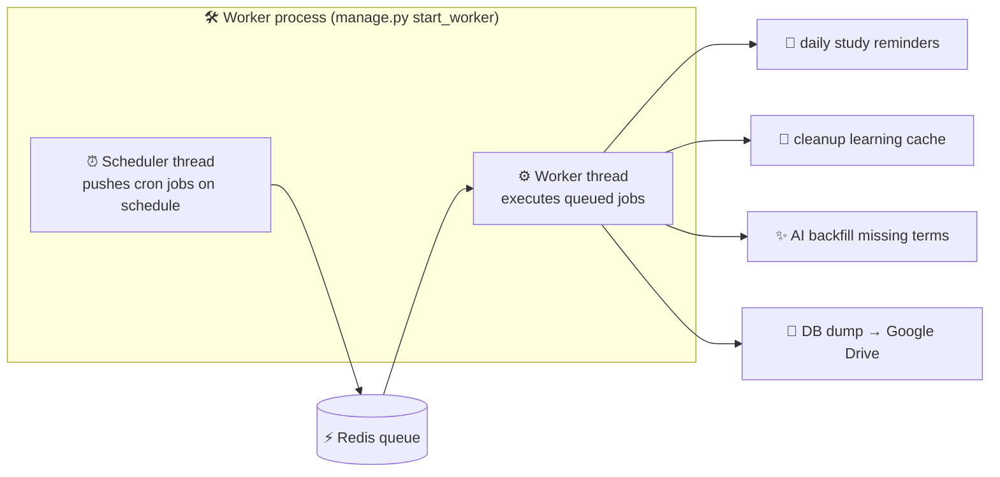

| Job | Schedule | Purpose |
|-----|----------|---------|
| `daily_reminders` | `0 1 * * *` | Email users who haven't studied today |
| `cleanup_learning_cache` | `0 * * * *` | Evict stale learning‑progress cache |

Define new schedules in `backend/cron.py → register_jobs()`. The
`dispatch()` helper enqueues a job if a worker is live, otherwise runs it inline.

---

## 🧩 Chrome extension

Select text on **any** web page → translate → save to your default deck.

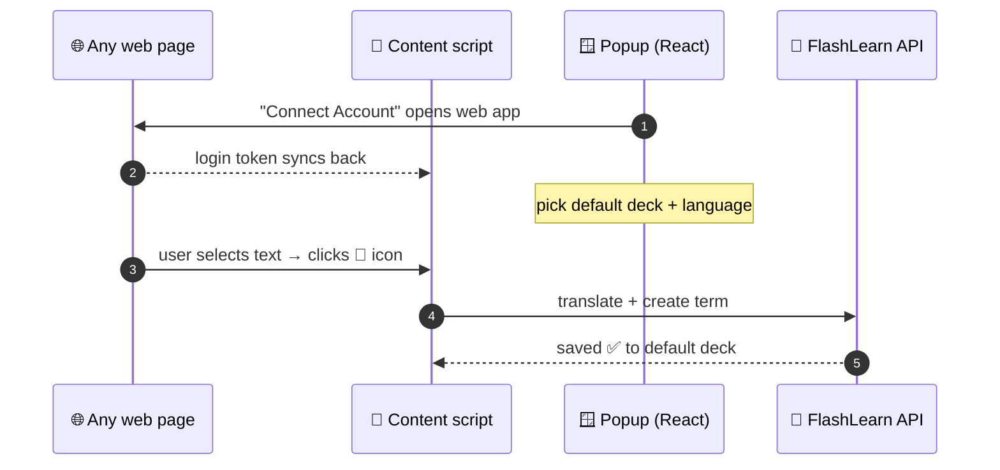

Built on Chrome MV3 + React. The web‑app URL must appear in
`manifest.json` content‑script matches so the auth token can sync after login.

---

## 🚢 Deployment

Multiple Docker Compose profiles cover every scenario; Nginx routes to whichever
backend is active.

```mermaid
flowchart LR
    subgraph compose["docker-compose"]
        DB[("MySQL")] --- RD[("Redis")] --- BE["backend"] --- WK["worker"] --- FE["frontend"]
    end
    Hub["🐳 Docker Hub<br/>ngovandong/flashlearn_*"]
    BE -. build.sh push .-> Hub
    FE -. build.sh push .-> Hub
```

| File | Use |
|------|-----|
| `docker-compose.yml` | Production — db, redis, backend, worker, frontend |
| `docker-compose.dev.yml` | Dev hot‑reload (mounts local code) |
| `docker-compose.dockerhub.*.selfservice.yml` | Run pre‑built Hub images (ARM64/AMD64) |

Build & push with `DOCKER=podman ./build.sh [--platform linux/arm64]`.

---

<div align="center">

### 🧭 Where to go next

**Build & run commands · env vars** → [`CLAUDE.md`](./CLAUDE.md) &nbsp;·&nbsp;
**AI‑agent rules** → [`AGENTS.md`](./AGENTS.md) &nbsp;·&nbsp;
**Worker / Docker / testing** → [`README.md`](./README.md) &nbsp;·&nbsp;
**Codebase knowledge graph** → [`graphify-out/GRAPH_REPORT.md`](./graphify-out/GRAPH_REPORT.md)

<sub>Diagrams authored in Mermaid · Generated for the FlashLearn project 🐉</sub>

</div>
