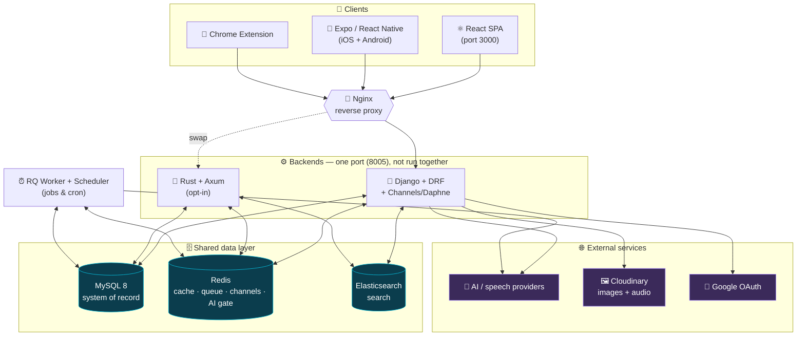

<div align="center">

# 🐉 FlashLearn

#### *Learn faster. Speak better. Remember forever.*

A language-learning platform with **flashcards**, guided **courses**, **Grammar**,
**Listening**, AI **Speaking and Writing Coaches**, mixed cross-feature
**revision**, **web and React Native clients**, a **Chrome extension**, and a
dual **Django + Rust** backend sharing one database.


</div>

> [!IMPORTANT]
> 📐 **New here? Read [`ARCHITECTURE.md`](./ARCHITECTURE.md)** — a fully
> illustrated, diagram-driven tour of the system: bounded contexts, the data
> model, the AI engine (failover + rate gate), the Speaking Coach flow, the
> realtime game, and deployment. The notes below cover **build, run, worker,
> Docker, and testing**.

## What's inside

| Area | Highlights |
|------|-----------|
| 🧠 **Study** | Decks & flashcards, Learn / Revise / Quiz / Fill / Number Test modes |
| 📚 **Courses** | Guided English lessons, generated dialogue audio, and scored Live Role-play |
| 🎧 **Listening** | Topic-based listen-and-type dictation with saved progress |
| 📖 **Grammar** | Textbook-style units, server-graded exercises, and AI explanations |
| ✨ **AI** | Term enrichment (word → Oxford-style entry), image crawler, translation |
| 🗣️ **Speaking Coach** | AI dialogue + TTS + per-word pronunciation scoring (Gemini multimodal) |
| ✍️ **Writing Coach** | Tutor chat, free-form writing assessment, and saved history |
| 🔁 **Mixed Revise** | Priority review of vocabulary, grammar, listening, and speaking mistakes |
| 🎮 **Realtime** | Multiplayer Quick-Revise game over WebSockets (Django Channels) |
| 👥 **Social** | Public deck cloning, OWNER/EDIT/VIEW roles, invites |
| 📱 **Mobile** | Expo app with native auth, dashboard, reminders, themes, and settings |
| 🧩 **Extension** | Select text on any page → translate → save to your default deck |

## 🧰 Tech stack

<table>
<tr><th>Layer</th><th>Technology</th><th>Role in FlashLearn</th></tr>

<tr><td rowspan="7"><b>🐍 Django backend</b><br/><sub>primary API</sub></td>
<td>Python 3.11 · Django 4.2</td><td>Core web framework, ORM, migrations (owns the schema)</td></tr>
<tr><td>Django REST Framework 3.15</td><td>ViewSets, serializers, the REST API surface</td></tr>
<tr><td>Django Channels 4 + Daphne</td><td>ASGI server & WebSockets for the multiplayer game</td></tr>
<tr><td>SQLAlchemy 2 (read side)</td><td>Hand‑tuned read queries alongside the Django ORM</td></tr>
<tr><td>django‑rq + rq‑scheduler</td><td>Background jobs & cron (emails, cache cleanup, backups)</td></tr>
<tr><td>drf‑yasg</td><td>Swagger / ReDoc API docs (DEBUG only)</td></tr>
<tr><td>DDD / clean architecture</td><td>Bounded contexts wired through <code>backend/shared/composition.py</code></td></tr>

<tr><td rowspan="4"><b>🦀 Rust backend</b><br/><sub>opt‑in replacement</sub></td>
<td>Rust 2021 · Axum 0.7</td><td>High‑performance partial re‑implementation of the API</td></tr>
<tr><td>SQLx 0.8 · Tokio 1</td><td>Async MySQL access over the same schema</td></tr>
<tr><td>JWT · pbkdf2</td><td>Token validation & Django‑compatible password checks</td></tr>
<tr><td>DDD layering</td><td>domain / application / infrastructure / interfaces</td></tr>

<tr><td rowspan="6"><b>⚛️ Web frontend</b></td>
<td>React 18</td><td>SPA UI</td></tr>
<tr><td>Material UI 7 + Emotion</td><td>Component library & styling</td></tr>
<tr><td>Redux Toolkit 2 + React‑Redux</td><td>Global state</td></tr>
<tr><td>TanStack Query 5</td><td>Server‑state caching & fetching</td></tr>
<tr><td>React Router 7</td><td>Routing</td></tr>
<tr><td>Sass + CSS custom properties</td><td>Runtime theming (light/dark + palettes)</td></tr>

<tr><td rowspan="6"><b>📱 Mobile frontend</b></td>
<td>Expo 51 · React Native 0.74</td><td>Native iOS and Android client</td></tr>
<tr><td>Expo Router 3</td><td>File-based routes and tab navigation</td></tr>
<tr><td>React Native Paper 5</td><td>Material components and runtime themes</td></tr>
<tr><td>Redux Toolkit 2</td><td>Authentication and client state</td></tr>
<tr><td>TanStack Query 5</td><td>Server-state caching and fetching</td></tr>
<tr><td>SecureStore · AuthSession</td><td>Native token storage and Google sign-in</td></tr>

<tr><td rowspan="4"><b>🗄️ Data & infra</b></td>
<td>MySQL 8</td><td>System of record (shared by both backends)</td></tr>
<tr><td>Redis 6</td><td>Cache, RQ queue, Channels layer, AI rate‑gate</td></tr>
<tr><td>Elasticsearch 8</td><td>Full‑text deck & term search</td></tr>
<tr><td>Cloudinary</td><td>Image and generated/listening audio storage</td></tr>

<tr><td rowspan="6"><b>🤖 AI & external</b></td>
<td>Google Gemini</td><td>Multimodal text/JSON, dialogue, TTS, and pronunciation fallback</td></tr>
<tr><td>OpenRouter · Azure OpenAI · LM Studio</td><td>Configurable text/JSON providers and failover</td></tr>
<tr><td>ElevenLabs · Azure TTS · Kokoro</td><td>Cloud or optional local text-to-speech</td></tr>
<tr><td>Azure Speech</td><td>Measured pronunciation assessment</td></tr>
<tr><td>Google OAuth</td><td>Social login</td></tr>
<tr><td>Playwright (Chromium)</td><td>Headless fallback for the Google image crawler</td></tr>

<tr><td><b>🧩 Extension</b></td>
<td>React + Chrome MV3</td><td>Select‑text‑to‑save on any web page</td></tr>

<tr><td><b>🚢 Delivery</b></td>
<td>Docker Compose · Podman · Nginx</td><td>Local, dev hot‑reload, and self‑service deployment</td></tr>
</table>

## 🗺️ System architecture (bird's‑eye view)



> [!NOTE]
> **Both backends speak the same database and the same port 8005.** They are
> *never* run simultaneously — the Rust backend is an opt‑in, in‑progress
> performance re‑implementation. **Django owns all migrations**; Rust only
> reads/writes the schema Django defines.

> See [`ARCHITECTURE.md`](./ARCHITECTURE.md) for the illustrated system guide,
> [`CLAUDE.md`](./CLAUDE.md) for commands and environment variables, and
> [`AGENTS.md`](./AGENTS.md) for project contribution rules.

## Setup

### Prerequisites

- Python 3.11+
- Node.js 18+
- MySQL
- Redis

### Backend Setup

1.  Install the locked dependencies with [uv](https://docs.astral.sh/uv/):
    ```bash
    uv sync --frozen --no-cache
    ```
2.  Set up environment variables:
    ```bash
    cp .env.sample .env
    ```
3.  Run migrations:
    ```bash
    uv run python manage.py migrate
    ```
4.  Start the server on the project's API port:
    ```bash
    uv run python manage.py runserver 0.0.0.0:8005
    ```

Optional feature dependencies are installed on demand:

```bash
# Google Images browser fallback
uv sync --group crawler
uv run playwright install chromium

# Local Kokoro TTS (also requires espeak-ng)
uv sync --group tts
```

### Frontend Setup

The `frontend/` folder is an npm-workspace monorepo containing the web app
(`apps/web`), the mobile app (`apps/mobile`), and shared packages
(`packages/*`).

1.  Navigate to the frontend directory:
    ```bash
    cd frontend
    ```
2.  Install dependencies (all workspaces at once):
    ```bash
    npm install
    ```
3.  Start the web development server:
    ```bash
    npm run dev:web
    ```

### Mobile App Setup

The Expo app is at [`frontend/apps/mobile`](./frontend/apps/mobile). After
installing the frontend workspaces:

```bash
cd frontend
cp apps/mobile/.env.sample apps/mobile/.env.local
npm run dev:mobile
```

Set `EXPO_PUBLIC_API_BASE_URL` in `.env.local` to an address reachable from the
target device. Use `127.0.0.1` for the iOS Simulator, `10.0.2.2` for the Android
Emulator, or your computer's LAN IP for a physical device. The Django server
must listen on `0.0.0.0:8005`.

See the [mobile app README](./frontend/apps/mobile/README.md) for Google OAuth
configuration, app structure, target-specific commands, tests, and
troubleshooting.

## Background Worker & Cron Jobs

FlashLearn uses [RQ](https://python-rq.org/) for background job processing and [rq-scheduler](https://github.com/rq/rq-scheduler) for recurring cron tasks. Both run inside a single worker process — no extra container needed.

### How it works

```
Worker process
├── main thread   → RQ Worker    (executes jobs from the Redis queue)
└── daemon thread → RQ Scheduler (pushes cron jobs into the queue on schedule)
```

When the worker starts it:
1. Clears any previously registered scheduled jobs from Redis (prevents duplicates on restart)
2. Re-registers all jobs collected from `backend/cron/`
3. Starts the scheduler in a background thread
4. Starts the worker on the main thread

### Starting the worker locally

Redis must be running first.

```bash
uv run python manage.py start_worker
```

### Adding a new cron job

**Step 1** — Write the task function in the relevant `backend/tasks/<domain>.py`
module.

```python
def my_new_task():
    # do work here
    logger.info("my_new_task ran")
```

**Step 2** — Add a `CronJob` to the corresponding `backend/cron/<domain>.py`
module, and register a new domain module in `backend/cron/__init__.py` when
needed:

```python
from backend.tasks.my_domain import my_new_task
from .registry import CronJob

jobs = [
    CronJob(
        id="my_new_task",
        cron="0 9 * * 1",  # every Monday at 09:00 UTC
        func=my_new_task,
    ),
]
```

**Step 3** — Restart the worker. It picks up the new schedule automatically.

### Cron expression reference

| Expression     | Meaning                        |
|----------------|--------------------------------|
| `0 1 * * *`    | Every day at 01:00 UTC         |
| `0 * * * *`    | Every hour on the hour         |
| `0 9 * * 1`    | Every Monday at 09:00 UTC      |
| `*/15 * * * *` | Every 15 minutes               |
| `0 0 1 * *`    | First day of every month 00:00 |

Use [crontab.guru](https://crontab.guru) to build and validate expressions.

### Built-in cron jobs

| Job ID                   | Schedule         | Description                                      |
|--------------------------|------------------|--------------------------------------------------|
| `daily_reminders`        | `0 1 * * *`      | Email users who haven't studied today (08:00 VNT)|
| `cleanup_learning_cache` | `0 * * * *`      | Evict stale learning-progress cache entries      |
| `fill_terms_with_ai` | `*/2 * * * *` | Enrich terms still missing AI-generated fields |
| `prewarm_speaking_audio` | `*/2 * * * *` | Generate uncached Speaking Coach audio |
| `daily_database_backup` | `0 3 * * *` | Back up MySQL to Google Drive (10:00 VNT) |
| `convert_term_images_to_base64` | `0 4 * * *` | Mirror/convert term images (11:00 VNT) |

### Monitoring the queue

```bash
# Live queue stats
uv run python manage.py rqstats

# Inspect failed jobs via Django admin
# → /admin/django_rq/  (requires DEBUG=True or admin access)
```

---

## Building & Publishing Docker Images

Use `build.sh` to build and push images to Docker Hub.

### Prerequisites
- [Podman](https://podman.io/) or Docker installed
- Logged in to Docker Hub (`podman login docker.io` or `docker login`)

### Usage

```bash
# Default build (linux/amd64, tagged :latest)
DOCKER=podman ./build.sh

# ARM64 build (tagged :arm64)
DOCKER=podman ./build.sh --platform linux/arm64
```

The `DOCKER` environment variable selects the container CLI (`docker` by default, override with `podman`).

| Platform flag | Image tag |
|---|---|
| *(none)* | `latest` |
| `--platform linux/arm64` | `arm64` |

Images pushed:
- `ngovandong/flashlearn_backend:<tag>`
- `ngovandong/flashlearn_frontend:<tag>`

### Running from Docker Hub (self-service)

Copy `.env.docker.sample` to `.env.docker`, fill in the values, then:

```bash
# ARM64 host using pre-built Docker Hub images
docker compose --env-file .env.docker \
  -f docker-compose.dockerhub.arm.selfservice.yml up -d

# Build the self-service stack locally
docker compose --env-file .env.docker \
  -f docker-compose.selfservice.yml up -d --build
```

---

## Code Quality

Pre-commit hooks run automatically on every `git commit`. They cover:

| Hook | Scope | What it does |
|---|---|---|
| `ruff check --fix` | Python | Linting — replaces flake8, isort, pyupgrade |
| `ruff format` | Python | Formatting — replaces autopep8/black |
| `bandit` | Python | Security scan (hardcoded secrets, unsafe calls) |
| `eslint --fix` | JS/JSX | React linting with auto-fix |
| `hadolint` | Dockerfile | Dockerfile best-practice checks |
| `shellcheck` | Shell | Shell script linting (`build.sh`, `run_docker.sh`) |
| `check-json/yaml/toml` | Config files | Syntax validation |
| `detect-private-key` | All | Blocks PEM private keys from being committed |

### First-time setup

```bash
# Install dev dependencies (includes pre-commit and ruff)
uv sync

# Install the git hook
uv run pre-commit install
```

### Running manually

```bash
# Run all hooks against staged files (same as a commit)
uv run pre-commit run

# Run all hooks against every file in the repo
uv run pre-commit run --all-files

# Run a specific hook only
uv run pre-commit run ruff --all-files
uv run pre-commit run eslint --all-files
uv run pre-commit run bandit --all-files
```

### Updating hook versions

```bash
uv run pre-commit autoupdate
```

### Skipping hooks (emergency only)

```bash
git commit --no-verify -m "your message"
```

---

## Testing

Run backend tests:

```bash
uv run python manage.py test backend.tests
```

### Image crawler testing

The image search API lives at `POST /api/images/` (`backend/services/crawler.py`).
Google uses Playwright when HTTP scraping is blocked — install the optional
crawler group and browser once:

```bash
uv sync --group crawler
uv run playwright install chromium
```

| Command | Purpose |
|---------|---------|
| `uv run python manage.py test backend.tests.test_crawler.GoogleImageParserTest -v 2` | Unit test (offline) |
| `CRAWLER_INTEGRATION=1 uv run python manage.py test backend.tests.test_crawler.CrawlerStrategyBenchmarkTest -v 2` | Live benchmark all 4 providers |

Use `CRAWLER_BENCHMARK_QUERY` and `CRAWLER_BENCHMARK_COUNT` to change the search term and result count. Set `CRAWLER_GOOGLE_SKIP_PLAYWRIGHT=1` to disable Google on low-memory servers.
